# Science-Grounded Literature Search

A Claude Code skill for preventing scientific hallucinations by requiring verified sources for all research claims. This tool provides programmatic access to multiple academic databases and enforces citation verification before making scientific statements.

## Purpose

Large language models are prone to hallucinating scientific citations - generating plausible-sounding but non-existent papers. This skill addresses that problem by:

1. Requiring verification through actual database searches before citing any paper
2. Providing unified access to 7 academic search engines
3. Caching results to minimize API calls and improve response time
4. Ranking papers by citation impact and relevance

## Architecture

```mermaid
%%{init: {'theme': 'base', 'themeVariables': { 'primaryColor': '#fdfdfd', 'edgeLabelBackground':'#ffffff', 'fontFamily': 'inter, sans-serif', 'fontSize': '14px', 'lineColor': '#b0bec5'}}}%%
graph TD
    classDef terminal fill:#e1f5fe,stroke:#b3e5fc,stroke-width:1px,color:#0277bd,rx:10,ry:10;
    classDef middleware fill:#f3e5f5,stroke:#e1bee7,stroke-width:1px,color:#6a1b9a,rx:5,ry:5;
    classDef cache fill:#eceff1,stroke:#cfd8dc,stroke-width:2px,color:#455a64,rx:5,ry:5;
    classDef apiSource fill:#fff3e0,stroke:#ffe0b2,stroke-width:1px,color:#ef6c00,rx:5,ry:5;
    classDef localSource fill:#fbe9e7,stroke:#ffccbc,stroke-width:1px,color:#d84315,stroke-dasharray: 5 3,rx:5,ry:5;
    classDef containerStyle fill:#fafafa,stroke:#f0f0f0,stroke-width:1px,color:#78909c,rx:10,ry:10;

    Start(["🔍 Claude Code CLI"]):::terminal --> Sanitizer("🧹 Query Sanitizer"):::middleware
    Sanitizer --> RateLimiter("⏱️ Rate Limiter"):::middleware
    RateLimiter --> Cache[("💾 Active Cache")]:::cache

    Cache --> PubMed & arXiv & bioRxiv & SemSch & NIH & NSF
    Cache --> LKB & LitMap

    subgraph SG_APIs ["🌐 External APIs"]
        direction LR
        PubMed("🏥 PubMed"):::apiSource
        arXiv("📜 arXiv"):::apiSource
        bioRxiv("🧬 bioRxiv"):::apiSource
        SemSch("🎓 Semantic Scholar"):::apiSource
        NIH("🏛️ NIH Reporter"):::apiSource
        NSF("💵 NSF Awards"):::apiSource
    end

    subgraph SG_Local ["📂 Local Sources (Optional)"]
        direction LR
        LKB("🧠 Knowledge Base"):::localSource
        LitMap("🗺️ Literature Mapper"):::localSource
    end

    PubMed & arXiv & bioRxiv & SemSch & NIH & NSF --> End(["✅ Verified Citations"]):::terminal
    LKB & LitMap --> End

    class SG_APIs,SG_Local containerStyle;
    linkStyle default stroke:#b0bec5,stroke-width:1px,fill:none;
```



## Supported Databases

| Database | Coverage | Script |
|----------|----------|--------|
| PubMed | Biomedical and clinical literature | `pubmed_search.py` |
| arXiv | Physics, math, CS, quantitative biology preprints | `arxiv_search.py` |
| bioRxiv/medRxiv | Biology and medicine preprints | `biorxiv_search.py` |
| Semantic Scholar | Cross-domain academic papers | `semantic_scholar_search.py` |
| NIH Reporter | NIH-funded grants and projects | `nih_reporter_search.py` |
| NSF Awards | NSF-funded research awards | `nsf_awards_search.py` |
| Local Knowledge Base | Project-specific paper collection | `local_kb_search.py` |

## Compatibility

This skill was developed and tested with **Claude Code CLI**. While the underlying Python scripts can work standalone, the full integration is designed for Claude Code.

- **Recommended**: Claude Code CLI (fully tested)
- **May work**: Other LLM CLIs with skill/plugin support
- **Standalone**: Python scripts can be imported directly

## Installation

```bash
# Clone the repository
git clone https://github.com/judepj/skills.git
cd skills/science-grounded

# Create virtual environment (optional)
python3 -m venv .venv
source .venv/bin/activate

# Install dependencies
pip install -r requirements.txt
```

### Optional: Local Configuration

To enable local knowledge base search and literature filing suggestions:

1. Copy the template config:
   ```bash
   cp config/local_paths.template.json config/local_paths.json
   ```

2. Edit `config/local_paths.json` with your paths:
   ```json
   {
     "knowledge_base": "/path/to/your/knowledge_base",
     "literature_dirs": {
       "project_1": "/path/to/project_1/literature",
       "project_2": "/path/to/project_2/literature"
     }
   }
   ```

The skill works without local configuration - these features will simply be disabled.

### Dependencies

- `requests` - HTTP client for API calls
- `arxiv` - arXiv API wrapper
- `biopython` - NCBI/PubMed access
- `diskcache` - Persistent caching
- `PyMuPDF` (fitz) - PDF text extraction for arXiv screening

## Directory Structure

```
science-grounded/
├── README.md                 # This file
├── SKILL.md                  # Claude Code skill definition and changelog
├── requirements.txt          # Python dependencies
├── scripts/                  # Search engine implementations
│   ├── paper_utils.py        # Shared utilities (caching, rate limiting, sanitization)
│   ├── pubmed_search.py      # PubMed/NCBI search
│   ├── arxiv_search.py       # arXiv search with PDF screening
│   ├── biorxiv_search.py     # bioRxiv/medRxiv search
│   ├── semantic_scholar_search.py  # Semantic Scholar search
│   ├── nih_reporter_search.py      # NIH grant search
│   ├── nsf_awards_search.py        # NSF award search
│   ├── local_kb_search.py    # Local knowledge base search
│   ├── relevance_scorer.py   # Keyword-based relevance scoring
│   ├── topic_classifier.py   # Research topic classification
│   ├── field_detector.py     # Academic field detection
│   ├── arxiv_pdf_screener.py # Full-text PDF analysis for arXiv
│   ├── literature_mapper.py  # Literature relationship mapping
│   ├── paper_tracker.py      # Paper tracking and management
│   └── test_*.py             # Test suites
├── config/                   # Configuration files
│   ├── local_paths.template.json  # Template for local paths (copy to local_paths.json)
│   ├── field_keywords.json   # Keywords for field detection
│   ├── category_keywords.json # Keywords for categorization
│   ├── authors.json          # Known author configurations
│   └── journals.json         # Journal impact factors and metadata
├── cache/                    # Cached search results (auto-generated)
├── logs/                     # API access logs (auto-generated)
└── data/                     # Persistent data storage
    └── paper_reviews.json    # Paper review records
```

## Usage

### Basic Search

```python
import sys
sys.path.append('/path/to/skills/scripts')

from pubmed_search import PubMedSearch
from arxiv_search import ArxivSearch

# Initialize searchers
pubmed = PubMedSearch()
arxiv = ArxivSearch()

# Search PubMed
results = pubmed.search("epilepsy sEEG seizure onset zone", max_results=10)
for paper in results:
    print(f"{paper['title']} ({paper['year']})")
    print(f"  Authors: {', '.join(paper['authors'][:3])}")
    print(f"  PMID: {paper.get('pmid', 'N/A')}")

# Search arXiv
results = arxiv.search("neural ODEs dynamical systems", max_results=10)
for paper in results:
    print(f"{paper['title']}")
    print(f"  arXiv ID: {paper['arxiv_id']}")
```

### Search by Author

```python
from pubmed_search import PubMedSearch

pubmed = PubMedSearch()
papers = pubmed.search_by_author("Savarraj", max_results=20)
```

### Local Knowledge Base Search

```python
from local_kb_search import LocalKBSearch

kb = LocalKBSearch(kb_path="/path/to/knowledge_base")
results = kb.search("HAVOK chaos intermittent forcing")
```

### Relevance Scoring

```python
from relevance_scorer import RelevanceScorer

scorer = RelevanceScorer()
score = scorer.score_paper(title, abstract, target_topics=["epilepsy", "sEEG"])
```

## Key Features

### Query Sanitization

All queries are sanitized to prevent injection attacks while preserving legitimate search syntax:

- SQL injection patterns blocked
- Command injection blocked
- XSS patterns blocked
- PubMed field tags (e.g., `[Author]`, `[Title]`) preserved

### Rate Limiting

Each search engine respects API rate limits:

- PubMed: 3 requests/second (NCBI guideline)
- arXiv: 1 request/3 seconds
- Semantic Scholar: 100 requests/5 minutes
- bioRxiv: 1 request/second

### Caching

Results are cached to minimize redundant API calls:

- Default TTL: 24 hours
- Epilepsy-related queries: 7 days
- Review articles: 30 days
- Cache stored in `cache/` directory using diskcache

### Impact-Based Ranking

Papers are sorted by citation count and impact metrics when available. This helps surface the most influential work first.

## Configuration

### Adding Known Authors

Edit `config/authors.json` to add frequently searched authors:

```json
{
  "sridevi_sarma": {
    "names": ["Sridevi Sarma", "Sridevi V Sarma", "S Sarma"],
    "affiliation": "Johns Hopkins University",
    "fields": ["epilepsy", "neural engineering", "control theory"]
  }
}
```

### Customizing Field Detection

Edit `config/field_keywords.json` to adjust field detection keywords:

```json
{
  "epilepsy": ["seizure", "epileptic", "ictal", "interictal", "sEEG", "ECoG"],
  "dynamical_systems": ["attractor", "bifurcation", "chaos", "Lyapunov", "manifold"]
}
```

## Testing

```bash
cd scripts

# Run all tests
python test_all.py

# Run specific test suites
python test_local_kb.py
python test_author_search.py
python test_sanitization.py
python test_improvements.py
```

## Integration with Claude Code

This skill is designed to be used with Claude Code. When integrated, it enforces the following workflow:

1. User asks about scientific topics
2. Claude searches for verified sources using this skill
3. Only papers confirmed to exist are cited
4. Citations include DOI, PMID, or arXiv ID for verification

The skill definition in `SKILL.md` contains the full integration instructions.

## File Descriptions

### Core Scripts

| File | Description |
|------|-------------|
| `paper_utils.py` | Shared utilities including query sanitization, rate limiting, caching, and result sorting. All search scripts depend on this module. |
| `pubmed_search.py` | Searches PubMed/NCBI for biomedical literature. Uses E-utilities API. Returns PMIDs, titles, authors, abstracts, and publication dates. |
| `arxiv_search.py` | Searches arXiv for preprints. Supports category filtering (q-bio.NC, cs.LG, etc.). Optional PDF screening for relevance. |
| `biorxiv_search.py` | Searches bioRxiv and medRxiv for biology and medicine preprints. |
| `semantic_scholar_search.py` | Searches Semantic Scholar for cross-domain papers. Returns citation counts and influential citation flags. |
| `nih_reporter_search.py` | Searches NIH Reporter for funded grants and projects. Useful for finding ongoing research. |
| `nsf_awards_search.py` | Searches NSF award database for funded projects. |
| `local_kb_search.py` | Searches a local knowledge base of papers stored as JSON extractions. Searches before external APIs to reduce calls. |

### Analysis Scripts

| File | Description |
|------|-------------|
| `relevance_scorer.py` | Scores papers for relevance to target topics using an 8-category keyword system (core terms, modalities, brain regions, neuromodulation, etc.). |
| `topic_classifier.py` | Classifies papers into research topics based on title and abstract content. |
| `field_detector.py` | Detects the academic field of a paper (neuroscience, physics, computer science, etc.). |
| `arxiv_pdf_screener.py` | Downloads arXiv PDFs, extracts full text, and scores relevance. Deletes PDFs after screening. |
| `literature_mapper.py` | Maps relationships between papers (citations, shared authors, shared topics). |
| `paper_tracker.py` | Tracks papers of interest and their review status. |

### Configuration Files

| File | Description |
|------|-------------|
| `config/local_paths.template.json` | Template for local paths configuration. Copy to `local_paths.json` and customize. |
| `config/field_keywords.json` | Keywords used to detect academic fields. |
| `config/category_keywords.json` | Keywords for paper categorization. |
| `config/authors.json` | Known authors with name variants and affiliations. |
| `config/journals.json` | Journal metadata including impact factors. |

## Limitations

- Rate limits may slow down bulk searches
- Some databases require institutional access for full text
- Citation counts may lag behind recent publications
- arXiv PDF screening requires download (bandwidth consideration)

## License

This project is provided for research and educational purposes.
